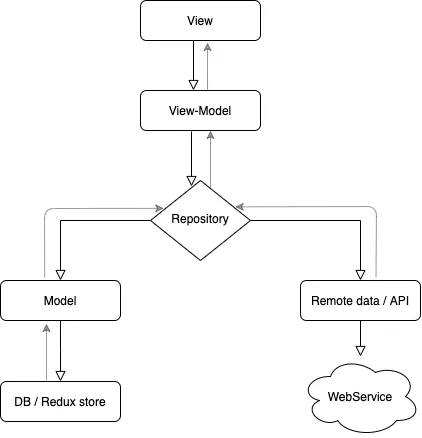

# transaction_app

This is a demo project introducing an approach to structure large scale mobile applications in Flutter build on top of REDUX state management combined with MVVM (Model View ViewModel) software architecture pattern. This demo is an asignment of BPC Company.


## Documentation

The following description represents the general info about this project and how to set it up and run it. For more detailed information and explanations about the project check out the wiki on this repo.

### Straight into code!

#### Environment

In the flutter projects `pubspec.yaml` file and add the following dependencies.

```
environment:
  sdk: '>=2.2.2 <3.0.0'
dependencies:
  flutter:
    sdk: flutter
  cupertino_icons: ^1.0.2
  flutter_redux: ^0.10.0
  redux: ^5.0.0
  http: ^1.1.0
  json_serializable: ^6.7.1
  json_annotation: ^4.8.1
  shared_preferences: ^2.2.1
  get_it: ^7.6.4
  dartz: ^0.10.1
  sticky_grouped_list: ^3.1.0
  equatable: ^2.0.5
  flutter_lints: ^2.0.0
  build_runner: ^2.4.6

```

#### Project structure

```
/lib
--/assets     #Contains all assets like icons, fonts, images
--/widgets   #General use common widget
--/utils       #General app config, contants files
--/base_redux   #Base state, dispatch for redux
--/data
    ../api
    ../exceptions
    ../local
    ../repositories
--/presentation     #MVVM pattern in presentation layer
    ../splash
    ../login
    ../home
    ../transactions
    ../transactions_group
    ../transaction_details
--/services       #Dependencies with getIt
```
